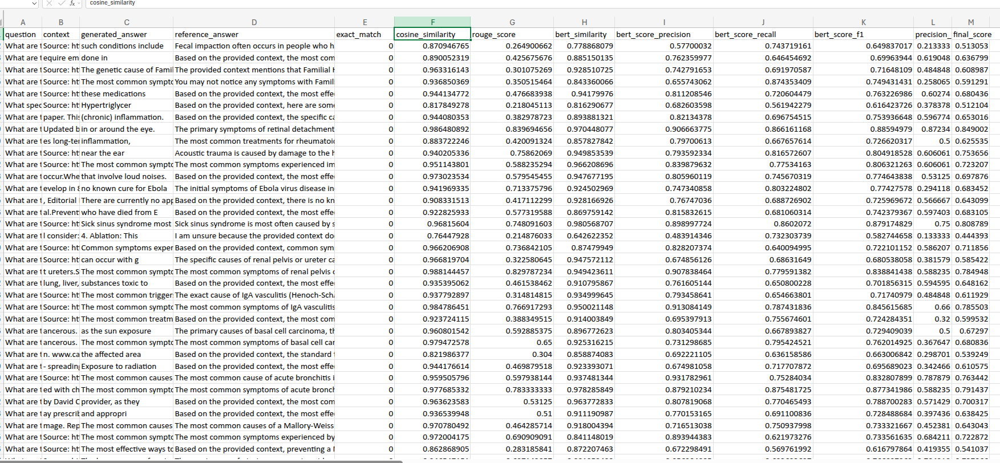

# AI-Powered Medical Q&A Extraction from Medline

This project aims to create a high-quality dataset of medical questions and answers by leveraging advanced AI technologies. The dataset is generated by scraping medical content from the Medline website, processing it into vector embeddings, and using a large language model (LLM) to generate contextually relevant Q&A pairs. This dataset is intended for use in medical AI applications, such as virtual health assistants, medical chatbots, and educational tools.

---

## Project Overview

The project involves the following key steps:
1. **Web Scraping**: Extracting structured medical content from 3,000 Medline webpages.
2. **Vector Embedding Generation**: Converting the extracted text into semantic vector representations using the MiniLM-L6-v2 model and storing them in ChromaDB.
3. **Q&A Generation**: Using Mistral AI to generate 2,000 medical questions and their corresponding answers based on the extracted content.
4. **Data Storage**: Storing the generated Q&A pairs along with their context in a CSV file for further use.
5. **Streamlit UI Integration**: Building an interactive user interface (UI) using Streamlit to test and visualize the pipeline.

---

## Technologies and Libraries Used

- **Web Scraping**:
  - `requests`: Fetching webpage content.
  - `BeautifulSoup`: Parsing HTML to extract structured medical content.
  - `glob` & `os`: File handling and directory management.

- **Vector Embedding & Storage**:
  - `chromadb`: A vector database for efficient storage and retrieval of medical text embeddings.
  - `MiniLM-L6-v2`: Transformer-based embedding model for generating semantic vector representations.
  - `MedlinePlusVectorizer`: Custom implementation for processing and storing embeddings.

- **Language Model for Q&A Generation**:
  - `langchain_mistralai.ChatMistralAI`: Leveraging Mistral AI to generate medical questions and answers.

- **Supporting Libraries**:
  - `dotenv`: Handling API keys and environment variables securely.
  - `streamlit`: Building an interactive UI to test the pipeline.
  - `uuid`: Assigning unique identifiers for tracking each document in the database.
  - `tqdm`: Providing progress bars for efficient processing of large datasets.
  - `datetime`: Timestamping operations for logging and versioning data.
  - `torch`: Supporting deep learning computations when necessary.

- **Evaluation Metrics:**
  - `rouge_score`: For calculating ROUGE scores.
  - `evaluate`: For exact match evaluation.
  - `bert_score`: For BERT-based precision, recall, and F1 scores.
  - `sklearn.metrics`: For precision and accuracy scores.

---

## Workflow Steps

### Step 1: Web Scraping Medline Data
- Implemented `MedlinePlusScraper` to crawl and extract 3,000 webpages from the Medline website.
- Extracted structured text content, including titles, main content, and metadata.
- Used `BeautifulSoup` for parsing and cleaning the scraped HTML.

### Step 2: Generating Vector Embeddings
- Chunked the extracted text into meaningful segments for better representation.
- Used `MiniLM-L6-v2` to convert text into vector embeddings.
- Stored embeddings in ChromaDB for fast retrieval based on semantic similarity.

### Step 3: AI-Powered Question-Answer Generation
- Integrated Mistral AI (`ChatMistralAI`) to generate 2,000 medical questions based on extracted content.
- Generated accurate and contextually relevant answers for each question.
- Ensured alignment of questions with relevant context from the Medline articles.
- Performed data validation to avoid redundant or low-quality Q&A pairs.

### Step 4: Storing Processed Data in CSV
- Stored the structured Q&A dataset in a CSV file named `medline_qa_dataset.csv`.
- CSV Columns:
  - **Question**: AI-generated medical question based on Medline text.
  - **Answer**: Mistral AI-generated response for the given question.
  - **Context**: Relevant passage from Medline used to generate the Q&A pair.

### Step 5: Streamlit UI Integration
- Developed an interactive UI using Streamlit to allow users to input medical queries and receive AI-generated answers.
- Displayed the context and source of the answers for transparency.
- Enabled users to test the pipeline and visualize the results in real-time.

### Step 6: Evaluation of LLM
- Evaluate the performance of the LLM using metrics such as Exact Match, Cosine Similarity, ROUGE Score, BERT Similarity, BERTScore, BERTRecall ,BERT Precison , Precision Score, and a weighted Final Score.
- Log the results in a CSV file for further analysis.


---

## Screenshot


- Medline Website <br>


- UI for searching the question <br>


- Evaluation ScreenShot <br>



## How to Use

**Clone the Repository**:
   ```bash
   git clone https://github.com/HarshitKumarShorthillsAI/RAG.git
   cd RAG
